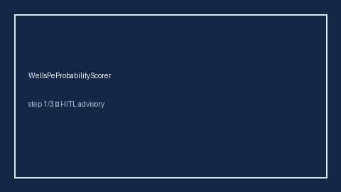

# WellsPeProbabilityScorer Guide



Research-only advisory clinical score. Never modifies medications.

Prefer **GPT-5.5 / Claude Sonnet 4.6 / Gemini 3.x / Kimi K2** for narratives.

Distinct from `HasBledBleedRiskScorer / Cha2ds2VascStrokeRiskScorer`.

## Usage

```python
from medagent.safety.wells_pe_probability_scorer import WellsPeFactors, WellsPeProbabilityScorer

findings = WellsPeProbabilityScorer().check(WellsPeFactors())
assert findings[0].rationale.startswith("RESEARCH USE ONLY")
```
